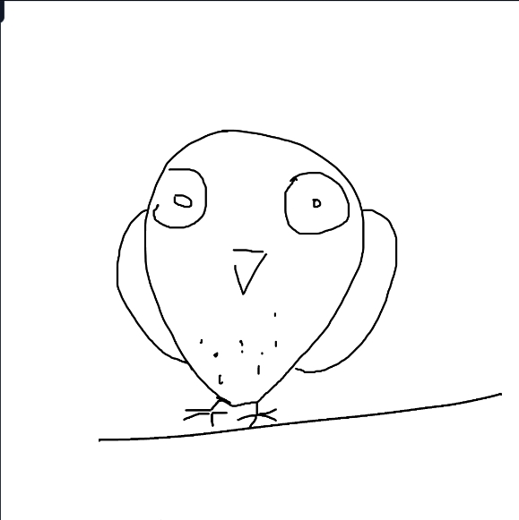
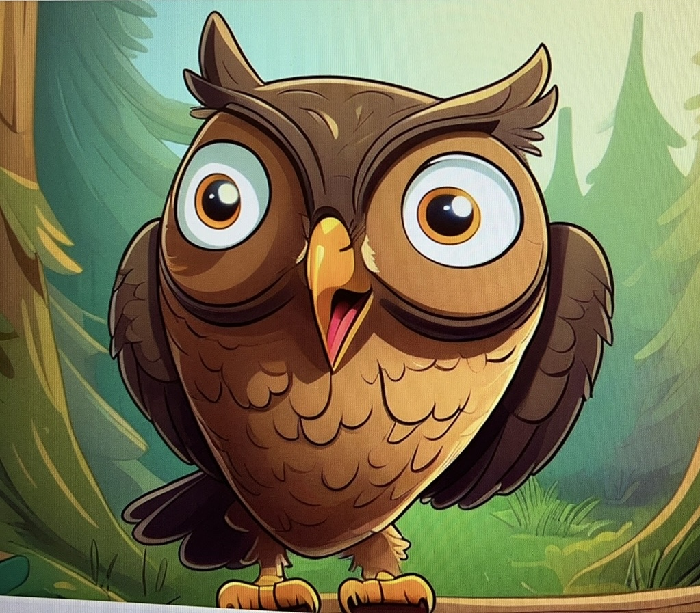

# Doodle2Cartoon AIDraw

**Miaohui Tongxin: From Doodle to Artwork**

Doodle2Cartoon AIDraw is an SDXL-powered image generation demo that turns simple children’s doodles into vivid cartoon-style illustrations. Users upload a sketch or hand-drawn image, provide a text prompt, and the backend preserves the rough structure while generating a richer, more polished illustration.

The project exposes a lightweight Flask API that accepts a Base64-encoded image and a prompt, then returns a generated PNG image. The generation pipeline is built with Hugging Face Diffusers, Stable Diffusion XL, T2I-Adapter, PidiNet, VAE, and LoRA.

## Features

- Converts hand-drawn doodles or simple sketches into cartoon illustrations.
- Uses T2I-Adapter Sketch and PidiNet to preserve the input structure.
- Supports prompt-based semantic control.
- Uses LoRA weights to enhance the final cartoon style.
- Provides a Flask API that can be connected to a web, mobile, or desktop frontend.

## Tech Stack

- Python 3.8
- Flask / Flask-Cors
- PyTorch
- Hugging Face Diffusers
- Stable Diffusion XL
- T2I-Adapter Sketch SDXL
- SDXL VAE fp16 fix
- LoRA
- ControlNet Aux / PidiNet
- Pillow / OpenCV / NumPy

## Pipeline

```text
Input doodle
    ↓
Flask receives Base64 image and prompt
    ↓
PidiNet extracts sketch structure
    ↓
T2I-Adapter injects sketch conditioning
    ↓
Stable Diffusion XL generates the image
    ↓
LoRA enhances cartoon style
    ↓
Flask returns the generated PNG
```

## Example

The example below shows a simple owl doodle transformed into a full cartoon-style illustration. The model keeps the large eyes, beak, wings, and pose while adding a polished character design, forest background, and bright colors.

| Input sketch | Generated image |
| --- | --- |
|  |  |

## Repository Structure

```text
.
├── apistart.py                       # Final Flask API entrypoint
├── img2img.py                        # Final image-to-image generation pipeline
├── assets/examples/                  # README example images
├── requirements.txt
└── README.md
```

The local project folder may also contain older experiment scripts and local model folders, such as `operate/`, `main_t2i_sketch.py`, `switchstyle.py`, `useLora.py`, `lora/`, `sdxl-vae-fp16-fix/`, and `t2i-adapter-sketch-sdxl-1.0/`. These are kept locally for reference or runtime use, but they are ignored by `.gitignore` and are not part of the GitHub release.

## Model Downloads

Large model weights are not committed to this repository. Before running the project, place the following folders in the project root. The folder names must match the relative paths used by the code.

```text
stable-diffusion-xl-base-1.0/
Annotators/
lora/
sdxl-vae-fp16-fix/
t2i-adapter-sketch-sdxl-1.0/
```

Use the Hugging Face CLI to download the public model assets:

```bash
pip install -U huggingface_hub

huggingface-cli download stabilityai/stable-diffusion-xl-base-1.0 \
  --local-dir stable-diffusion-xl-base-1.0

huggingface-cli download TencentARC/t2i-adapter-sketch-sdxl-1.0 \
  --local-dir t2i-adapter-sketch-sdxl-1.0

huggingface-cli download madebyollin/sdxl-vae-fp16-fix \
  --local-dir sdxl-vae-fp16-fix

huggingface-cli download lllyasviel/Annotators \
  --local-dir Annotators
```

The LoRA style weight is a local asset and must be prepared separately. The current final pipeline in `img2img.py` expects:

```text
lora/Web_Cartoon.safetensors
```

If you have access to the original server, copy it from the source project:

```bash
mkdir -p lora
scp hdu@117:/data/cyy/aigc/lora/Web_Cartoon.safetensors lora/
```

If you want to use a different LoRA, place it under `lora/` and update the `weight_name` argument in `img2img.py`. All model folders and checkpoint files are ignored by `.gitignore` and should not be pushed to GitHub.

Optional depth-control experiments may also use the following folders, but they are not required for the final Flask API flow:

```bash
huggingface-cli download TencentARC/t2i-adapter-depth-midas-sdxl-1.0 \
  --local-dir t2i-adapter-depth-midas-sdxl-1.0

huggingface-cli download TencentARC/t2iadapter-aux-models \
  --local-dir t2iadapter-aux-models
```

## Installation

Create a Python environment:

```bash
conda create -n miaohui python=3.8
conda activate miaohui
pip install -r requirements.txt
```

If you use CUDA, install a PyTorch build that matches your GPU driver and CUDA version. The original server environment used:

```text
Python 3.8.19
torch 2.2.2 + cu118
diffusers 0.27.2
transformers 4.46.3
xformers 0.0.25.post1
controlnet_aux 0.0.7
```

## Run the Flask API

After placing the required model folders in the project root, start the Flask service:

```bash
python apistart.py
```

Default address:

```text
http://0.0.0.0:5000
```

Generation endpoint:

```text
POST /generate_image
```

Example request body:

```json
{
  "prompt": "a cute owl standing in a colorful forest",
  "style": "webcartoon",
  "image": "base64 encoded image"
}
```

The response is a PNG image stream.

## Final Runtime Scripts

The cleaned GitHub version keeps only the two core scripts:

```text
apistart.py -> Flask backend entrypoint. Receives Base64 image, prompt, and style.
img2img.py  -> SDXL + T2I-Adapter + PidiNet + LoRA image-to-image pipeline.
```

`apistart.py` exposes `/generate_image`, decodes the `image` field into a PIL image, and calls `runimg` from `img2img.py` to generate the final image. Older test scripts, standalone text-to-image demos, and multi-style experiments are kept out of the GitHub version.

## Notes

- An NVIDIA GPU is strongly recommended for practical runtime performance.
- SDXL, adapter, VAE, LoRA, and annotator weights are large and should not be committed to GitHub.
- Some local scripts use fixed relative paths, so keep model folder names consistent with this README.
- `operate/main_t2i_depth.py` references `t2i-adapter-depth-midas-sdxl-1.0/`, which is not required for the current Flask API flow.

## Project Goal

The goal of Doodle2Cartoon AIDraw is to make visual creation easier and more playful: a child can draw a simple sketch, and the system expands it into a richer illustration that can become the starting point for stories, picture books, or interactive creative tools.
